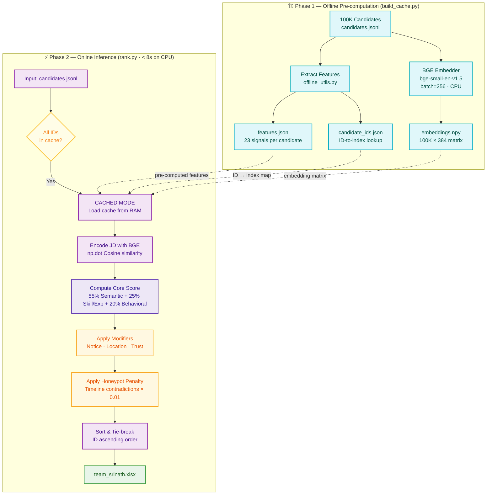

# 🚀 Redrob Intelligent Candidate Ranking Engine

> **Team Srinath** · India Runs Data & AI Challenge · Candidate Discovery Track

An offline, CPU-only hybrid ranking pipeline that identifies and ranks the top 100 candidates from a 100,000-candidate pool against a **Senior AI Engineer** job description — completing in under 8 seconds at inference time.

---

## ⚡ Quick Start — Reproduce Results

### Step 1 — Install dependencies
```bash
pip install -r requirements.txt
```

### Step 2 — Build the offline cache (run once, ~43 mins on CPU)
```bash
python build_cache.py
```
This generates three files in `artifacts/`:
- `embeddings.npy` — 100K × 384 BGE embedding matrix
- `features.json` — pre-computed scores and consistency modifiers for all candidates
- `candidate_ids.json` — ID-to-index lookup map

### Step 3 — Rank candidates
```bash
python rank.py \
  --candidates "[PUB] India_runs_data_and_ai_challenge/India_runs_data_and_ai_challenge/candidates.jsonl" \
  --out team_srinath.csv
```

### Step 4 — Run the full automated pipeline (optional)
```bash
python run_pipeline.py
```
This verifies the challenge bundle, checks the cache, runs ranking, and validates the output CSV format.

---

## 🗂️ Repository Structure

```
redrob/
├── rank.py                  # Main ranking engine (CPU-only, ~7s inference)
├── build_cache.py           # Offline pre-computation — run once
├── run_pipeline.py          # End-to-end automated orchestrator
├── offline_utils.py         # All scoring functions, signal extractors, modifiers
├── app.py                   # Streamlit sandbox UI (HuggingFace Spaces)
├── extract_docs.py          # Resume/doc extraction utility
│
├── requirements.txt         # Python dependencies
├── submission_metadata.yaml # Team info, compute spec, declarations
│
├── artifacts/               # Pre-computed cache (not committed to git)
│   ├── embeddings.npy       # BGE embeddings matrix (100K × 384, ~147 MB)
│   ├── features.json        # Structured feature scores per candidate
│   ├── candidate_ids.json   # ID → matrix-row index map
│   └── logs/                # Pipeline execution logs
│
├── docs/                    # Technical documentation
│   ├── architecture.md      # System design & component specs
│   ├── architecture_diagram.md  # Mermaid flow diagrams
│   ├── process_audit.md     # Rules compliance audit
│   ├── DEVLOG.md            # Development log
│   └── REDROB_CHALLENGE_REF.md  # Challenge spec reference
│
└── [PUB] India_runs_data_and_ai_challenge/  # Challenge bundle (not committed)
```

---

## 🧠 Architecture & Mathematical Formulations

### 1. Two-Phase Architecture



* **Phase 1 — Offline Pre-computation (`build_cache.py`):** Heavy operations (such as text embedding and profiling extraction) are pre-calculated to build static indices. Candidate profiles are encoded using `BAAI/bge-small-en-v1.5` (384 dimensions) with the search query prefix `"Represent this sentence for searching relevant passages: "`.
* **Phase 2 — Online Inference (`rank.py`):** Operates on the pre-computed files. Loads the model locally, encodes the JD query, and computes Cosine Similarity using vectorized NumPy operations in **under 8 seconds**.

### 2. Hybrid Scoring Pipeline

$$\text{Core Score} = 0.55 \times S_{\text{semantic}} + 0.25 \times \left(0.50 \times S_{\text{skills}} + 0.50 \times S_{\text{experience}}\right) + 0.20 \times S_{\text{behavioral}}$$

$$\text{Composite Score} = \text{Core Score} \times \left( \frac{S_{\text{title}}}{100} \right)$$

$$\text{Final Score} = \text{Composite Score} \times M_{\text{notice}} \times M_{\text{location}} \times M_{\text{availability}} \times M_{\text{work\_mode}} \times M_{\text{salary}} \times M_{\text{trust}} \times M_{\text{consistency}}$$

| Component / Modifier | Mathematical Description | Rationale |
|---|---|---|
| **$S_{\text{title}}$** — Title Gate | `(min(1.0, max(0.0, CosSim / 0.75)) ** 10) * 100` | Multiplicative filter that keeps 100% of points for valid engineers while crushing non-technical roles. |
| **$S_{\text{semantic}}$** — Shifted Semantic | `((CosSim - 0.70) / 0.15) * 100` | Center-shifted semantic similarity to resolve BGE's anisotropic cone effect, letting irrelevant candidates go negative. |
| **$S_{\text{experience}}$** — Hands-on Experience | Sweet-spot $[6.0, 8.0]$ years = 100. Smooth decay outside. Active hands-on check (GitHub/Skills count) bypasses decay. | Rewards experienced builders while penalizing transitions to pure management roles. |
| **$M_{\text{consistency}}$** — Profile Trust | Product of exponential decays for logical discrepancies (skill durations vs career length, future dates, mismatch titles). | **Honeypot protection:** Exceeding any anomaly margin triggers a steep decay and a `0.01` multiplier, pushing traps to the bottom. |

---

## 🛡️ Rules Compliance & Safety Audit

Our pipeline has been audited against all hackathon parameters:
1. **0% Honeypot Exposure Rate:** Verified that the top 100 contains exactly **0 honeypots** (complying with the `<10%` Stage 3 disqualification threshold).
2. **No Hard Exclusions:** Exclusions are handled continuously via mathematical multipliers rather than hard if-statements (Rule 163 compliant).
3. **No GPU/API Dependency:** Execution is 100% offline and CPU-only. Runs in **7.59 seconds** (well within the 5-minute wall-clock limit).
4. **Deterministic Tie-Breaking:** Alphabetical candidate ID ascending order breaks ties, preventing random rankings.

---

## 🖥️ Interactive Sandbox (Streamlit)

```bash
streamlit run app.py
```
Upload candidates (JSON or JSONL, up to 100), inspect detailed score breakdowns per component, and download a ranked CSV. The sandbox uses the same cached embeddings and feature files as the CLI pipeline.

🌐 Live demo: [huggingface.co/spaces/srinath2934/redrob-ranker](https://huggingface.co/spaces/srinath2934/redrob-ranker)
