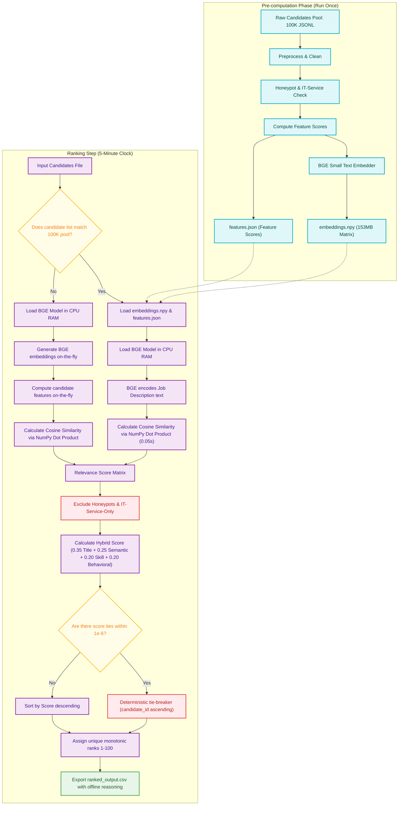

# System Architecture & Pipeline Design: Redrob Candidate Ranker

This document details the system design, processing stages, and mathematical formulations for the candidate ranking pipeline. The pipeline is designed to process 100,000 candidate profiles against a Senior AI Engineer job description, running on a standard CPU within a 5-minute window using pre-computed embeddings and feature scores. Both phases (pre-computation and ranking) execute 100% offline.

---

## 1. High-Level Data Flow

The ranking pipeline operates as a **lightweight pre-computed similarity and features matcher**. To satisfy the 5-minute compute budget on CPU without internet access or running external database servers, all heavy operations are completed in the pre-computation phase. During the ranking step, the system performs fast vector retrieval using NumPy dot products, applies safety filters, scores candidates using a multi-factor hybrid formula, and resolves ties deterministically.

```
       [Raw Candidates (100K JSONL)]
                     │
                     ▼ (Pre-computation Phase - Run Once)
           ┌─────────────────────┐
           │ 1. Feature Prep     │ ──> Computes scores, flags fakes & service-only
           └──────────┬──────────┘
                     │
                     ▼
           ┌─────────────────────┐
           │ 2. BGE Embedding    │ ──> Generates BGE vectors for all 100K candidates
           └──────────┬──────────┘
                     │
                     ▼
           ┌─────────────────────┐
           │ 3. Save Cache files │ ──> Saves embeddings.npy & features.json to disk
           └─────────────────────┘

                     │
                     ▼ (Ranking Step - 5 min Clock)
           ┌─────────────────────┐
           │ 4. Similarity calc  │ ──> Encodes JD; calculates Cosine Similarity
           │                     │     via NumPy Dot Product (np.dot)
           └──────────┬──────────┘
                     │
                     ▼
           ┌─────────────────────┐
           │ 5. Hard Exclusions  │ ──> Prunes Honeypots & IT-Service-Only
           └──────────┬──────────┘
                     │
                     ▼
           ┌─────────────────────┐
           │ 6. Hybrid Scoring   │ ──> Title (35%) + Semantic (25%) +
           │                     │     Skill/Exp (20%) + Behavioral (20%)
           └──────────┬──────────┘
                     │
                     ▼
           ┌─────────────────────┐
           │ 7. Tie-Breaking     │ ──> Deterministic Candidate ID ascending
           └──────────┬──────────┘
                     │
                     ▼
           ┌─────────────────────┐
           │ 8. Export Top 100   │ ──> Writes ranked output CSV (with offline reasoning)
           └─────────────────────┘
```

### Detailed Mermaid Diagram



---

## 2. Stage 1: Safety Filters (Honeypot & IT-Service Exclusions)

To protect the ranking from disqualified candidates and meet the honeypot threshold limit ($<10\%$ in the top 100), the system evaluates each candidate against safety checkers. If a candidate triggers any of these checkers, they are assigned a score of `0` and immediately pruned.

### A. Honeypot Profiling Heuristics
Honeypots are synthetic profiles designed with impossible data patterns. The system flags a profile as a honeypot if it triggers any of the following:
1.  **Expert Skill Inflation**: The count of skills marked `"expert"` with `duration_months == 0` is $\ge 10$.
2.  **Job Duration Anomaly**: For any role in `career_history`:
    *   Let $D_{\text{calc}}$ be the calculated duration in months between `start_date` and `end_date` (or `2026-06-17` if `is_current` is true or `end_date` is null).
    *   Let $D_{\text{stated}}$ be the candidate's reported `duration_months`.
    *   If $|D_{\text{calc}} - D_{\text{stated}}| > 3$ months, the candidate is flagged.
3.  **Future Dates**: Any start or end date in career history that falls after the reference date `2026-06-17`.
4.  **Skill Duration Over-inflation**: Any individual skill where `duration_months` is greater than the total career experience (sum of all job durations) plus a 12-month grace period.

### B. IT Consulting Services Exclusion
The Job Description explicitly disqualifies candidates who have *only* worked at IT outsourcing/consulting firms. 
*   **Definition of IT Service Firms**: `["TCS", "Infosys", "Wipro", "Accenture", "Cognizant", "Capgemini", "L&T", "Larsen & Toubro", "Tech Mahindra", "Mindtree", "HCL"]` (case-insensitive substring matches).
*   **Rule**: If the candidate has $\ge 1$ job in their career history, and **every single job** is at one of these service firms, the candidate is disqualified.
*   *Note*: If a candidate is currently at a service firm but has prior product-company experience, they remain in the pipeline.

---

## 3. Stage 2: Hybrid Scoring Formula

For candidates passing the exclusions, we compute a final composite score:

$$\text{Final Score} = 0.35 \times S_{\text{title}} + 0.25 \times S_{\text{semantic}} + 0.20 \times S_{\text{skill\_depth}} + 0.20 \times S_{\text{behavioral}}$$

### A. Title Relevance Score ($S_{\text{title}}$)
Weights candidate titles directly:
*   **Target ML/AI Engineering Title**: Current title contains `"Machine Learning"`, `"ML"`, `"AI"`, `"Search"`, `"Ranking"`, or `"Retrieval"` $\rightarrow$ **100 points**.
*   **Technical Pipeline Title**: Current title contains `"Software"`, `"Backend"`, or `"Data"` with ML exposure $\rightarrow$ **70 points**.
*   **Trap Titles (Disqualified)**: Current title contains `"Marketing"`, `"Sales"`, `"Recruiter"`, `"HR"`, `"Operations"`, or `"Consultant"` $\rightarrow$ **0 points**.

### B. Semantic Match Score ($S_{\text{semantic}}$)
*   Cosine similarity between BGE Small encoded vector of the Job Description and BGE Small encoded vector of the candidate profile (headline + summary + career history descriptions).
*   Calculated via NumPy dot product between pre-computed candidate embeddings and the JD vector, normalized to a $[0, 100]$ scale.

### C. Skill Depth & Experience Fit Score ($S_{\text{skill\_depth}}$)
Calculated as:
$$S_{\text{skill\_depth}} = 0.50 \times S_{\text{skills}} + 0.50 \times S_{\text{experience}}$$

#### 1. Skill Fit ($S_{\text{skills}}$)
*   We sum the weights of matched core skills:
    *   **Core Retrieval/Vector DBs (Weight = 1.0)**: Pinecone, Milvus, FAISS, Qdrant, Weaviate, BGE, E5, vector search, dense retrieval.
    *   **Ranking & Evaluation (Weight = 0.8)**: learning-to-rank, NDCG, MAP, MRR, ranking, hybrid search, Elasticsearch.
    *   **Applied ML/NLP (Weight = 0.5)**: NLP, machine learning, deep learning, PyTorch, HuggingFace, fine-tuning.
*   Adjusted by skill proficiency weight (`expert` = 1.0, `advanced` = 0.8, `intermediate` = 0.5, `beginner` = 0.2) and skill duration.

#### 2. Refined Experience Fit Score ($S_{\text{experience}}$)
To ensure we do not penalize highly experienced candidates who are still active builders, we implement a **hands-on validation rule**:
*   If total experience $Y$ is in the sweet spot $[6.0, 8.0]$ years $\rightarrow$ **100 points**.
*   If experience $Y$ is below 6.0 years $\rightarrow$ Decays smoothly ($S_{\text{experience}} = 100 - (6.0 - Y) \times 40$).
*   If experience $Y$ is above 8.0 years:
    *   **Hands-on Check**: If candidate has `github_activity_score >= 30` OR `skills_count >= 15` OR their current title is an active engineering role (i.e. does not contain `"VP"`, `"Director"`, `"Manager"`, `"Architect"`) $\rightarrow$ **100 points** (No penalty, they are active builders!).
    *   **Otherwise (Management/Architect decay)**: Decays smoothly to penalize non-coding transition profiles ($S_{\text{experience}} = \max(0, 100 - (Y - 8.0) \times 15)$).

### D. Behavioral & Platform Score ($S_{\text{behavioral}}$)
Integrates candidate behaviors and platform signals:
$$S_{\text{behavioral}} = 0.30 \times S_{\text{github}} + 0.25 \times S_{\text{responsiveness}} + 0.20 \times S_{\text{activity}} + 0.15 \times S_{\text{reliability}} + 0.10 \times S_{\text{demand}}$$

1.  **GitHub Score ($S_{\text{github}}$)**: Claims `github_activity_score` directly (or 0 if `-1`).
2.  **Responsiveness ($S_{\text{responsiveness}}$)**: `recruiter_response_rate` (0 to 100) minus a penalty for high response latency (`avg_response_time_hours`).
3.  **Activity Recency ($S_{\text{activity}}$)**: Logs recency. If inactive for $>180$ days relative to `2026-06-17`, score is `0`.
4.  **Platform Reliability ($S_{\text{reliability}}$)**: Average of `interview_completion_rate` and `offer_acceptance_rate`.
5.  **Recruiter Demand ($S_{\text{demand}}$)**: Aggregated percentile score of `saved_by_recruiters_30d` and `profile_views_received_30d`.

---

## 4. Stage 3: Availability & Logistics Modifiers

The composite score is multiplied by logistics modifiers to prioritize local and readily hireable candidates:

$$\text{Final Score} = \text{Composite Score} \times M_{\text{notice}} \times M_{\text{location}}$$

*   **Notice Period Modifier ($M_{\text{notice}}$)**:
    *   Notice period $\le 30$ days $\rightarrow$ $1.0$
    *   Notice period $\le 60$ days $\rightarrow$ $0.90$
    *   Notice period $\le 90$ days $\rightarrow$ $0.75$
    *   Notice period $> 90$ days $\rightarrow$ $0.40$ (Substantial penalty)
*   **Location Fit Modifier ($M_{\text{location}}$)**:
    *   Country is NOT `"India"` and `willing_to_relocate` is False $\rightarrow$ $0.10$
    *   Country is NOT `"India"` and `willing_to_relocate` is True $\rightarrow$ $0.40$
    *   Country is `"India"` and location is Pune or Noida $\rightarrow$ $1.0$
    *   Country is `"India"`, location is Tier-1 (Bangalore, Mumbai, Delhi, Gurgaon, Hyderabad) and `willing_to_relocate` is True $\rightarrow$ $0.95$
    *   Country is `"India"`, location is Tier-1 and `willing_to_relocate` is False $\rightarrow$ $0.60$

---

## 5. Stage 4: Factual Offline Reasoning Generation

To prevent network dependency and run 100% offline within the 5-minute limit, the pipeline uses a dynamic, rule-based reasoning generator to construct the `reasoning` column in the final output CSV. This generator builds 1-2 sentence descriptions using real candidate facts to satisfy all validation checks:

*   **Strict Single-Line Constraint**: To prevent CSV cell corruption and comply with standard CSV parsers, the generated reasoning string is stripped of all raw newlines (`\n`) and carriage returns (`\r`). The generator replaces them with spaces to ensure each reasoning cell is printed on exactly one continuous line of text.

### A. Core Architecture & Slot-Filling Heuristic
The generator extracts exact facts from the candidate's JSON profile:
*   **Experience**: `profile.years_of_experience` (e.g. "6.5 years")
*   **Current Title**: `profile.current_title` (e.g. "Senior ML Engineer")
*   **Matched Skills**: Up to 3 of the candidate's skills matching core requirements (e.g. "PyTorch, Qdrant, NLP")
*   **Notice Period**: `redrob_signals.notice_period_days` (e.g. "30 days")
*   **Location**: `profile.location` (e.g. "Pune")

### B. Variation Heuristics (Avoiding Templates)
To avoid templated output penalties, the generator maintains a pool of 10+ distinct sentence structures. The generator dynamically selects and combines structures based on candidate characteristics (e.g. whether they have high GitHub activity or a long notice period), ensuring high linguistic variation.

### C. Rank Consistency Check
The tone and content of the reasoning are aligned with the assigned rank band:
1.  **Ranks 1–10 (Glowing / Top Picks)**: Focuses on perfect experience sweet-spots, target ML titles, and immediate availability (notice period $\le 30$ days).
    *   *Example*: `"Top-tier ML Engineer with 7 years experience building RAG systems; Pune-based with immediate availability."`
2.  **Ranks 11–50 (Strong Fits)**: Emphasizes solid technical match and active building credentials, noting minor concerns (e.g., notice period <= 60 days).
    *   *Example*: `"Strong NLP and retrieval engineer with 6 years experience; excellent GitHub activity despite a 60-day notice period."`
3.  **Ranks 51–100 (Moderate Fits / Gaps Acknowledged)**: Acknowledges honest concerns or gaps (location relocation, notice period $> 90$ days, or adjacent skills acting as filler candidates) to remain factual.
    *   *Example*: `"Solid ML background, but significant concern on notice period (120 days) and relocation needs from Bangalore."`

---

## 6. Stage 5: Deterministic Tie-Breaking & Bias Control

To satisfy challenge formatting requirements, candidate rankings must be monotonic and unique:
1.  **Monotonicity**: Score at rank $i \ge$ score at rank $i+1$.
2.  **Uniqueness**: Each rank integer $1$ through $100$ must appear exactly once. No duplicate ranks are allowed.

### Tie-Breaking Resolution
If two or more candidates have identical scores (or scores differing only within a floating-point precision of $\epsilon = 10^{-6}$), the tie is broken using a **deterministic lexicographical rule**:
*   **Candidate ID Ascending**: The candidate with the alphabetically smaller `candidate_id` is assigned the higher rank (e.g. `CAND_0000010` ranks ahead of `CAND_0000020`).

### Bias Control Principles
*   **No Randomness**: Avoid random or stochastic tie-breaking. Same input must guarantee the exact same ranking output (reproducible and auditable).
*   **No Domain-Feature Bias**: We explicitly avoid tie-breaking based on submission timestamps (which penalizes late-stage code improvements) or profile completeness (which rewards gaming the platform), selecting the candidate ID as the most transparent, neutral, and stable fallback.

