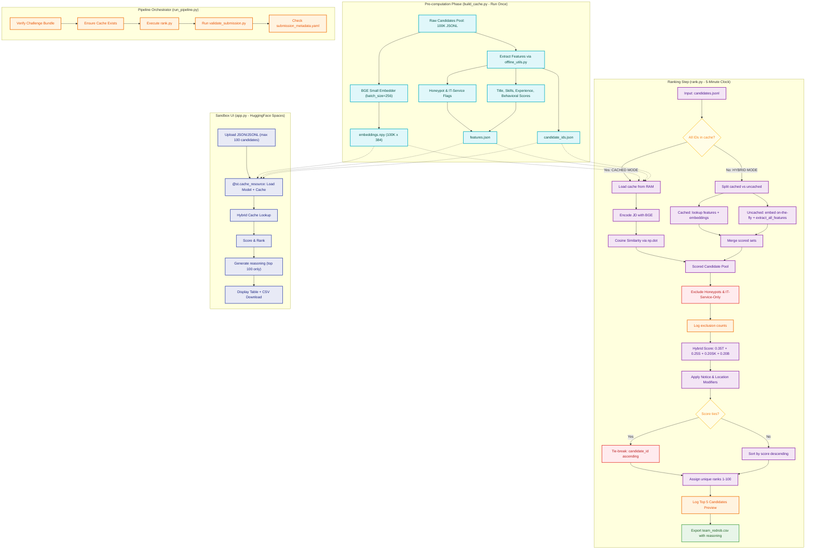

# 📊 Detailed Pipeline Architecture Diagram

This diagram visualizes the end-to-end data flow, dividing the system into the **Pre-computation Phase**, the **Ranking Step** (supporting Cached, Hybrid Dynamic, and Full Dynamic modes), and the **Sandbox UI**. All phases run 100% offline.

---

### 🎨 Color & Component Legend:
* **Teal Nodes**: **Pre-computation Phase** – run once to compress 100K text profiles into lightweight matrices and feature scores.
* **Purple Nodes**: **Ranking Step** – fast execution blocks for scoring, similarity computation, and CSV output.
* **Yellow Nodes**: **Decision Points** – runtime checks for cache availability and score tie detection.
* **Red Nodes**: **Exclusions & Bias Checks** – safety filters that prune honeypot/IT-service candidates and enforce deterministic sorting.
* **Orange Nodes**: **Logging** – structured log events written to `artifacts/logs/pipeline.log` for traceability.
* **Indigo Nodes**: **Sandbox UI** – Streamlit web app with cached resource loading, hybrid lookup, and CSV download.
* **Green Node**: **Final Output** – the verified, monotonic, 100-row submission CSV.
