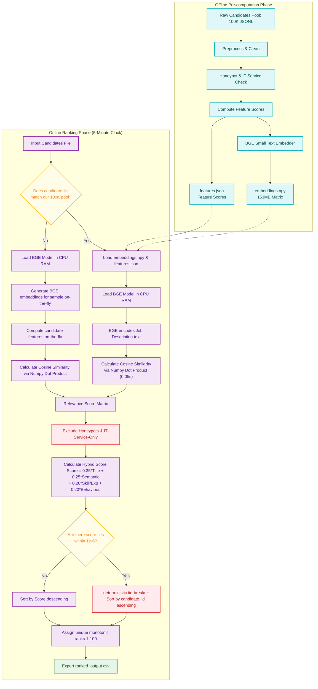

# 📊 Detailed Pipeline Architecture Diagram

This diagram visualizes the end-to-end data flow, dividing the system into the **Offline Pre-computation Phase** and the **Online Ranking Phase** (supporting both Cached and Dynamic modes).

---

### 🎨 Color & Component Legend:
* **Blue Nodes (Teal)**: **Offline Pre-computation** – run once beforehand to compress text profiles into lightweight matrices and feature scores.
* **Purple Nodes (Lavender)**: **Online Ranking Pipeline** – fast execution blocks that load model, vectors, and compute similarity.
* **Yellow Nodes (Gold)**: **Decision Points** – runtime checks that handle input mode branching and score tie-breaking.
* **Red Nodes (Crimson)**: **Exclusions & Bias Checks** – safety filters that prune honeypot/IT service candidates and enforce deterministic sorting.
* **Green Node (Emerald)**: **Final Output** – the verified, monotonic, 100-row submission CSV.
