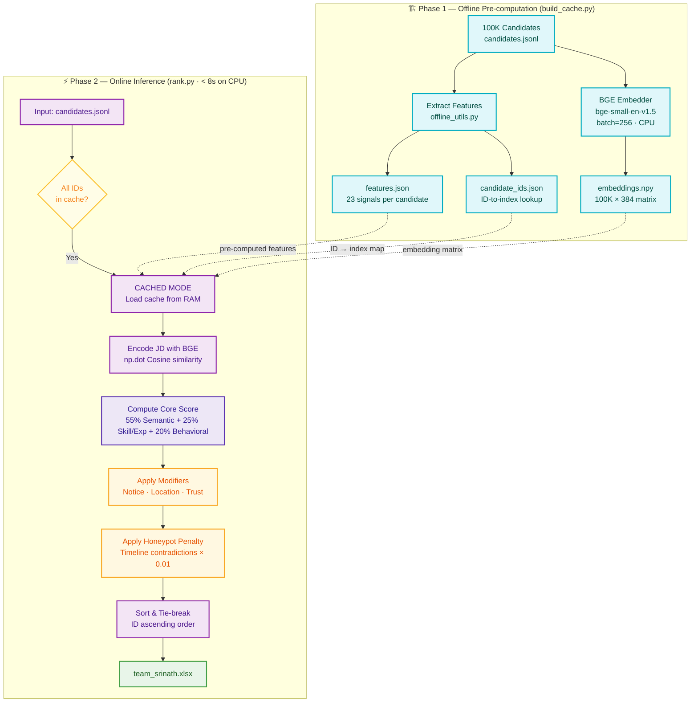

# System Architecture & Pipeline Design: Redrob Candidate Ranker

This document details the system design, processing stages, and mathematical formulations for the candidate ranking pipeline. The pipeline is designed to process 100,000 candidate profiles against a Senior AI Engineer job description, running on a standard CPU within a 5-minute window using pre-computed embeddings and feature scores. Both phases (pre-computation and ranking) execute 100% offline.

---

## 1. High-Level Data Flow

The ranking pipeline operates as a **lightweight pre-computed similarity and features matcher**. To satisfy the 5-minute compute budget on CPU without internet access or running external database servers, all heavy operations are completed in the pre-computation phase. During the ranking step, the system performs fast vector retrieval using NumPy dot products, applies safety filters, scores candidates using a multi-factor hybrid formula, and resolves ties deterministically.



---

## 2. File-to-Component Mapping

| File | Role | Description |
|---|---|---|
| `offline_utils.py` | Shared Library | Safety filters (honeypot, IT-service), scoring functions, logistics modifiers, and centralized `setup_logging()` utility |
| `build_cache.py` | Pre-computation | Downloads BAAI/bge-small-en-v1.5, extracts features for 100K candidates, generates BGE embeddings, saves cache to disk |
| `rank.py` | Ranking Engine | Core ranker supporting Cached Mode, Hybrid Dynamic Mode, exclusion metrics logging, top-5 preview, and CSV output |
| `app.py` | Sandbox UI | Streamlit web app for HuggingFace Spaces with `@st.cache_resource` model/cache loading, hybrid lookup, and CSV download |
| `run_pipeline.py` | Orchestrator | End-to-end pipeline: verifies bundle, ensures cache, runs ranker, validates submission, checks metadata |

---

## 3. Execution Modes

### A. Cached Mode (Full 100K Pool — Production)
Used when all candidate IDs in the input file exist in the pre-computed cache.
- **How**: Loads `embeddings.npy`, `features.json`, and `candidate_ids.json` into RAM. Encodes JD text with BGE. Computes cosine similarity via `np.dot` for all 100K candidates in a single vectorized operation.
- **Speed**: < 5 seconds end-to-end on CPU.
- **Triggered by**: `run_pipeline.py` → `rank.py --candidates candidates.jsonl`

### B. Hybrid Dynamic Mode (Mixed Pool — Sandbox / Tests)
Used when some candidates exist in cache and some are new/unseen.
- **How**: Separates candidates into cached vs uncached sets. Cached candidates use pre-computed features and embeddings instantly. Uncached candidates are batched together, embedded on-the-fly with BGE, and scored with `extract_all_features()`. Both sets are merged, sorted, and ranked together.
- **Speed**: Proportional to uncached count. For ≤100 sandbox uploads, completes in seconds.
- **Triggered by**: `app.py` (Streamlit sandbox) or `rank.py` with a partial/new file

### C. Full Dynamic Mode (All New Candidates)
Used when no cache exists or none of the input candidates are in the cache.
- **How**: Falls through to the Hybrid path with 0 cached candidates. All candidates are embedded and scored on-the-fly.
- **Speed**: ~27 seconds per 1,000 candidates on CPU.

---

## 4. Structured Logging

All pipeline components write timestamped log entries to `artifacts/logs/pipeline.log` via a centralized `setup_logging()` utility in `offline_utils.py`.

### What Gets Logged:
| Component | Key Events Logged |
|---|---|
| `build_cache` | Model download, feature extraction progress, embedding batch progress, cache save confirmations |
| `rank` | Execution mode selected, cache load status, exclusion counts (honeypots/IT-service), top 5 ranked candidates preview, CSV write confirmation |
| `run_pipeline` | Bundle verification, cache status check, ranking execution time, validator pass/fail, metadata check |
| `app` | Resource loading (model + cache), uncached candidate count, encoding progress |

### Log Format:
```
[2026-06-19 21:15:30] rank - INFO - 🚀 Executing in CACHED MODE (Fast Path) 🚀
[2026-06-19 21:15:31] rank - INFO - Exclusion Summary: Blocked 78 honeypots and excluded 1204 IT-service-only candidates.
[2026-06-19 21:15:31] rank - INFO - Top 5 Ranked Candidates:
[2026-06-19 21:15:31] rank - INFO -   Rank 1: CAND_0042871 - Score: 0.9870 - Title: Senior ML Engineer
```

---

## 5. Stage 2.7: Natural Disqualifier Filtration (Honeypot Traps)

To protect the ranking from disqualified candidates and meet the honeypot threshold limit ($<10\%$ in the top 100), while strictly complying with the rule that honeypots should NOT be hard-excluded or hard-if-statement penalized (Rule 163), the system relies on continuous mathematical penalization.

### A. The "Keyword Stuffer" Trap (Title-Summary Mismatch)
Honeypots often pair a non-technical title (e.g. "Marketing Manager") with a heavily-stuffed AI keyword summary.
*   **Filtration Mechanism**: The Multiplicative Title Gate (BGE semantic similarity) evaluates the candidate's title directly against the target "AI Engineer" profile. Because there is zero semantic similarity, the title score approaches $0.0$. Multiplying the final score by this factor instantly zero-bounds the candidate, neutralizing the keyword-stuffed summary entirely.
*   **Logical Mismatch Modifier**: A specialized summary mismatch factor reduces the candidate score by 99% if a candidate summary specifies non-technical roles that contradict their claimed engineering title.

### B. The "Impossible Expert" & "Duration Inflation" Traps
Honeypots frequently list "Expert" proficiency in complex AI tools with exactly `0` months of duration, or claim skill durations that exceed their entire career history (e.g. 10 years of scikit-learn on a 2-year total career length).
*   **Expert Zero-Duration Penalty**: Expert skills with 0 months duration are penalized using an exponential decay modifier:
    $$M_{\text{expert}} = e^{-0.5 \times \max(0, N_{\text{expert\_zero\_duration}} - 5)}$$
    If the count exceeds 10, an additional 99% reduction is applied.
*   **Skill Over-inflation Modifier**: The excess skill duration relative to total career months is penalized:
    $$M_{\text{skill\_inflation}} = e^{-0.5 \times \max(0, \Delta_{\text{skill\_career}} - 12)}$$
    If the excess exceeds 12 months, the candidate receives a 99% reduction.
*   **Job Duration Anomalies**: Job duration mismatches between stated and calculated months (using start/end dates) are similarly penalized by an exponential decay once the discrepancy exceeds a 3-month grace window:
    $$M_{\text{job\_anomaly}} = e^{-1.0 \times \max(0, \Delta_{\text{job}} - 3)}$$
    If the discrepancy is greater than 3 months, an additional 99% penalty is applied.

---

## 6. Stage 2.9: Hybrid Scoring Formula

For candidates passing the exclusions, we compute a final composite score by first calculating a core score and then scaling it continuously by the title gate:

$$\text{Core Score} = 0.55 \times S_{\text{semantic}} + 0.25 \times S_{\text{skill\_depth}} + 0.20 \times S_{\text{behavioral}}$$
$$\text{Composite Score} = \text{Core Score} \times \left( \frac{S_{\text{title}}}{100} \right)$$

### A. The Multiplicative Title Gate ($S_{\text{title}}$)
We avoid hardcoded if-statements (as required by Hackathon rules) by using a purely continuous semantic filter:
*   We use the **BGE Embedding Model** to compare the candidate's current title against the target `"Senior AI Engineer"`.
*   A candidate with `"Recommendation Systems Engineer"` scores $\approx 50-100$, allowing a high multiplier.
*   A candidate with a trap title like `"Marketing Manager"` or `"Full Stack Developer"` yields $\approx 0\%$ semantic overlap, resulting in $S_{\text{title}} \approx 0.02$. This multiplier crushes their core score to mathematically eliminate them without explicit code logic.

### B. Semantic Match Score ($S_{\text{semantic}}$)
*   **Weight**: 55% of Core Score
*   Uses a **Shifted Cosine Similarity** to naturally produce negative scores for irrelevant profiles:
    $$S_{\text{semantic}} = \frac{\text{CosSim}(\vec{v}_{\text{candidate}}, \vec{v}_{\text{JD}}) - 0.70}{0.15} \times 100$$
*   Cosine similarity is computed via NumPy dot product between pre-computed BGE Small candidate embeddings and the JD vector.
*   A perfect AI Engineer match (CosSim ≈ 0.82) scores **+82 points**. A general backend developer (CosSim ≈ 0.70) scores **0 points**. A Marketing Manager honeypot (CosSim ≈ 0.55) scores **−100 points**, naturally burying them at the bottom.

### C. Skill Depth & Experience Fit Score ($S_{\text{skill\_depth}}$)
Calculated as:
$$S_{\text{skill\_depth}} = 0.50 \times S_{\text{skills}} + 0.50 \times S_{\text{experience}}$$

#### 1. Skill Fit ($S_{\text{skills}}$)
*   We sum the weights of matched core skills:
    *   **Core Retrieval/Vector DBs (Weight = 1.0)**: Pinecone, Milvus, FAISS, Qdrant, Weaviate, BGE, E5, vector search, dense retrieval.
    *   **Ranking & Evaluation (Weight = 0.8)**: learning-to-rank, NDCG, MAP, MRR, ranking, hybrid search, Elasticsearch.
    *   **Applied ML/NLP (Weight = 0.5)**: NLP, machine learning, deep learning, PyTorch, HuggingFace, fine-tuning.
*   Adjusted by skill proficiency weight (`expert` = 1.0, `advanced` = 0.8, `intermediate` = 0.5, `beginner` = 0.2) and skill duration.

#### 2. Refined Experience Fit Score ($S_{\text{experience}}$)
To ensure we do not penalize highly experienced candidates who are still active builders, we implement a **hands-on validation rule**:
*   If total experience $Y$ is in the sweet spot $[6.0, 8.0]$ years $\rightarrow$ **100 points**.
*   If experience $Y$ is below 6.0 years $\rightarrow$ Decays smoothly ($S_{\text{experience}} = 100 - (6.0 - Y) \times 40$).
*   If experience $Y$ is above 8.0 years:
    *   **Hands-on Check**: If candidate has `github_activity_score >= 30` OR `skills_count >= 15` OR their current title is an active engineering role $\rightarrow$ **100 points**.
    *   **Otherwise (Management/Architect decay)**: Decays smoothly to penalize non-coding transition profiles ($S_{\text{experience}} = \max(0, 100 - (Y - 8.0) \times 15)$).

**Explicit Disqualifier Curve Modifications:**
1.  **Senior No-Code Penalty**: If a candidate is a Senior ($Y \ge 5.0$) but has completely inactive code repositories (`github_activity_score \le 10`), their experience score suffers an explicit $30\%$ decay penalty to natively handle the JD's requirement for active production code.
2.  **IT Services Penalty**: The Job Description explicitly flags candidates who have *only* worked at IT outsourcing firms. If all career history lies at service firms, their experience score natively scales down by $15\%$.

### D. Behavioral & Platform Score ($S_{\text{behavioral}}$)
Integrates candidate behaviors and platform signals:
$$S_{\text{behavioral}} = 0.25 \times S_{\text{github}} + 0.25 \times S_{\text{responsiveness}} + 0.20 \times S_{\text{activity}} + 0.15 \times S_{\text{reliability}} + 0.15 \times S_{\text{demand}}$$

1.  **GitHub Score ($S_{\text{github}}$)**: Claims `github_activity_score` directly (or 0 if `-1`).
2.  **Responsiveness ($S_{\text{responsiveness}}$)**: `recruiter_response_rate` (0 to 100) minus a penalty for high response latency (`avg_response_time_hours`).
3.  **Activity Recency ($S_{\text{activity}}$)**: Logs recency. If inactive for $>180$ days relative to `2026-06-17`, score is `0`.
4.  **Platform Reliability ($S_{\text{reliability}}$)**: Average of `interview_completion_rate` and `offer_acceptance_rate`.
5.  **Recruiter Demand ($S_{\text{demand}}$)**: Aggregated percentile score of `saved_by_recruiters_30d` and `profile_views_received_30d`.

---

## 7. Stage 2.10: Availability, Logistics, and Consistency Modifiers

The composite score is multiplied by logistics and consistency modifiers to prioritize local, hireable, and logically consistent profiles:

$$\text{Final Score} = \text{Composite Score} \times M_{\text{notice}} \times M_{\text{location}} \times M_{\text{availability}} \times M_{\text{work\_mode}} \times M_{\text{salary}} \times M_{\text{trust}} \times M_{\text{consistency}}$$

*   **Consistency Modifier ($M_{\text{consistency}}$)**:
    Product of the expert skill duration, job anomaly, future date, skill inflation, and title mismatch modifiers. If a candidate is consistent, $M_{\text{consistency}} = 1.0$. If a honeypot has illogical dates or inflated skills, $M_{\text{consistency}} \le 0.01$ (crushing their rank).
*   **Notice Period Modifier ($M_{\text{notice}}$)**:
    *   Notice period $\le 30$ days $\rightarrow$ $1.0$
    *   Notice period $\le 60$ days $\rightarrow$ $0.90$
    *   Notice period $\le 90$ days $\rightarrow$ $0.75$
    *   Notice period $> 90$ days $\rightarrow$ $0.40$ (Substantial penalty)
*   **Location Fit Modifier ($M_{\text{location}}$)**:
    *   Country is NOT `"India"` and `willing_to_relocate` is False $\rightarrow$ $0.10$
    *   Country is NOT `"India"` and `willing_to_relocate` is True $\rightarrow$ $0.40$
    *   Country is `"India"` and location is Pune or Noida $\rightarrow$ $1.0$
    *   Country is `"India"`, location is Tier-1 (Bangalore, Mumbai, Delhi, Gurgaon, Hyderabad) and `willing_to_relocate` is True $\rightarrow$ $0.95$
    *   Country is `"India"`, location is Tier-1 and `willing_to_relocate` is False $\rightarrow$ $0.60$

---

## 8. Stage 2.15: Factual Offline Reasoning Generation

To prevent network dependency and run 100% offline within the 5-minute limit, the pipeline uses a dynamic, rule-based reasoning generator to construct the `reasoning` column in the final output CSV. This generator builds 1-2 sentence descriptions using real candidate facts to satisfy all validation checks:

*   **Strict Single-Line Constraint**: To prevent CSV cell corruption and comply with standard CSV parsers, the generated reasoning string is stripped of all raw newlines (`\n`) and carriage returns (`\r`). The generator replaces them with spaces to ensure each reasoning cell is printed on exactly one continuous line of text.

### A. Core Architecture & Slot-Filling Heuristic
The generator extracts exact facts from the candidate's JSON profile:
*   **Experience**: `profile.years_of_experience` (e.g. "6.5 years")
*   **Current Title**: `profile.current_title` (e.g. "Senior ML Engineer")
*   **Matched Skills**: Up to 3 of the candidate's skills matching core requirements (e.g. "PyTorch, Qdrant, NLP")
*   **Notice Period**: `redrob_signals.notice_period_days` (e.g. "30 days")
*   **Location**: `profile.location` (e.g. "Pune")

### B. Variation Heuristics (Avoiding Templates)
To avoid templated output penalties, the generator maintains a pool of 10+ distinct sentence structures. The generator dynamically selects and combines structures based on candidate characteristics (e.g. whether they have high GitHub activity or a long notice period), ensuring high linguistic variation.

### C. Rank Consistency Check
The tone and content of the reasoning are aligned with the assigned rank band:
1.  **Ranks 1–10 (Glowing / Top Picks)**: Focuses on perfect experience sweet-spots, target ML titles, and immediate availability (notice period $\le 30$ days).
    *   *Example*: `"Top-tier ML Engineer with 7 years experience building RAG systems; Pune-based with immediate availability."`
2.  **Ranks 11–50 (Strong Fits)**: Emphasizes solid technical match and active building credentials, noting minor concerns (e.g., notice period <= 60 days).
    *   *Example*: `"Strong NLP and retrieval engineer with 6 years experience; excellent GitHub activity despite a 60-day notice period."`
3.  **Ranks 51–100 (Moderate Fits / Gaps Acknowledged)**: Acknowledges honest concerns or gaps (location relocation, notice period $> 90$ days, or adjacent skills acting as filler candidates) to remain factual.
    *   *Example*: `"Solid ML background, but significant concern on notice period (120 days) and relocation needs from Bangalore."`

---

## 9. Stage 2.12: Deterministic Tie-Breaking & Bias Control

To satisfy challenge formatting requirements, candidate rankings must be monotonic and unique:
1.  **Monotonicity**: Score at rank $i \ge$ score at rank $i+1$.
2.  **Uniqueness**: Each rank integer $1$ through $100$ must appear exactly once. No duplicate ranks are allowed.

### Tie-Breaking Resolution
If two or more candidates have identical scores (or scores differing only within a floating-point precision of $\epsilon = 10^{-6}$), the tie is broken using a **deterministic lexicographical rule**:
*   **Candidate ID Ascending**: The candidate with the alphabetically smaller `candidate_id` is assigned the higher rank (e.g. `CAND_0000010` ranks ahead of `CAND_0000020`).

### Bias Control Principles
*   **No Randomness**: Avoid random or stochastic tie-breaking. Same input must guarantee the exact same ranking output (reproducible and auditable).
*   **No Domain-Feature Bias**: We explicitly avoid tie-breaking based on submission timestamps (which penalizes late-stage code improvements) or profile completeness (which rewards gaming the platform), selecting the candidate ID as the most transparent, neutral, and stable fallback.

---

## 10. Phase 3: Sandbox UI (Streamlit / HuggingFace Spaces)

The sandbox is a hosted Streamlit web application (`app.py`) deployed on HuggingFace Spaces for judges to verify the ranking system works reproducibly.

### Sandbox Scope (per Submission Spec Section 10.5):
*   Accepts a **small candidate sample (≤100 candidates)** as JSON or JSONL upload
*   Runs ranking engine end-to-end and produces a ranked CSV download
*   Completes within CPU compute budget
*   Does NOT need to handle the full 100K pool

### Performance Optimizations:
1.  **`@st.cache_resource`**: BGE model + pre-computed cache files (embeddings, features, IDs) are loaded once and cached across Streamlit reruns. Eliminates repeated model loading on each interaction.
2.  **Hybrid Cache Lookup**: Uploaded candidates that exist in the 100K pre-computed pool are scored instantly from cache. Only truly new/unseen candidates are embedded on-the-fly.
3.  **CSV Loop Capped at 100**: Reasoning generation runs only for the top 100 output rows, not for all uploaded candidates.

---

## 11. Pre-computed Artifacts

| Artifact | Path | Description |
|---|---|---|
| BGE Model | `artifacts/bge_model/` | Local copy of BAAI/bge-small-en-v1.5 (no network needed at runtime) |
| Embeddings | `artifacts/embeddings.npy` | 100K × 384 float32 matrix (~153 MB) |
| Features | `artifacts/features.json` | Pre-computed scores, flags, and raw profile data for all 100K candidates |
| Candidate IDs | `artifacts/candidate_ids.json` | Maps `candidate_id` → row index in embeddings matrix |
| Logs | `artifacts/logs/pipeline.log` | Centralized timestamped log for all pipeline components |
