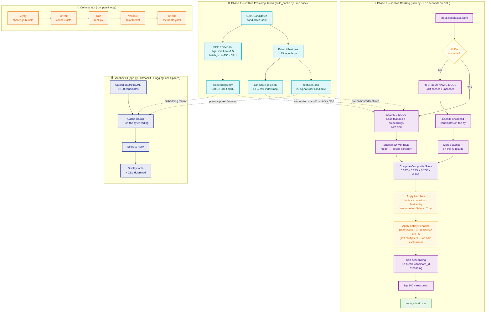
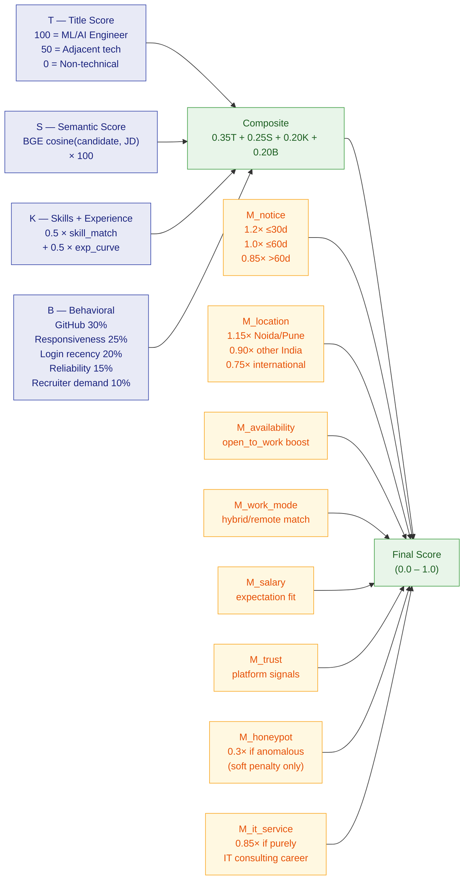
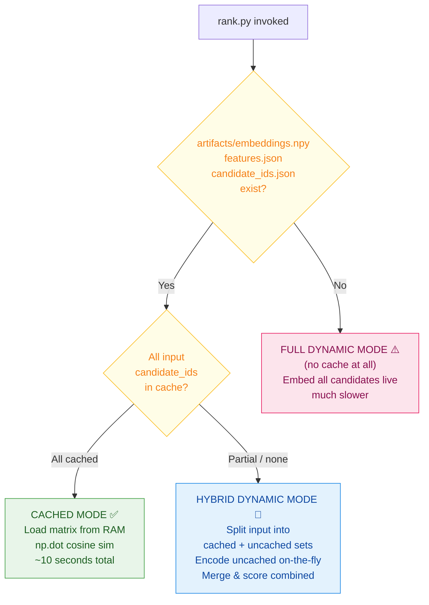

# 📊 Pipeline Architecture Diagrams

Mermaid diagrams for the Redrob ranking system. Three views: the end-to-end data flow, the scoring formula breakdown, and the execution mode decision tree.

---

## Diagram 1 — End-to-End Pipeline Flow

---

## Diagram 2 — Scoring Formula Breakdown

---

## Diagram 3 — Execution Mode Decision Tree

---

### 🎨 Colour Legend

| Colour | Phase |
|---|---|
| 🟦 Teal | Pre-computation (build_cache.py) |
| 🟪 Purple | Ranking engine steps (rank.py) |
| 🟨 Yellow | Decision / branch points |
| 🟧 Amber | Score modifiers |
| 🟩 Green | Outputs |
| 🔵 Blue | Sandbox UI (Streamlit) |
| 🟠 Orange | Logging / orchestration |
