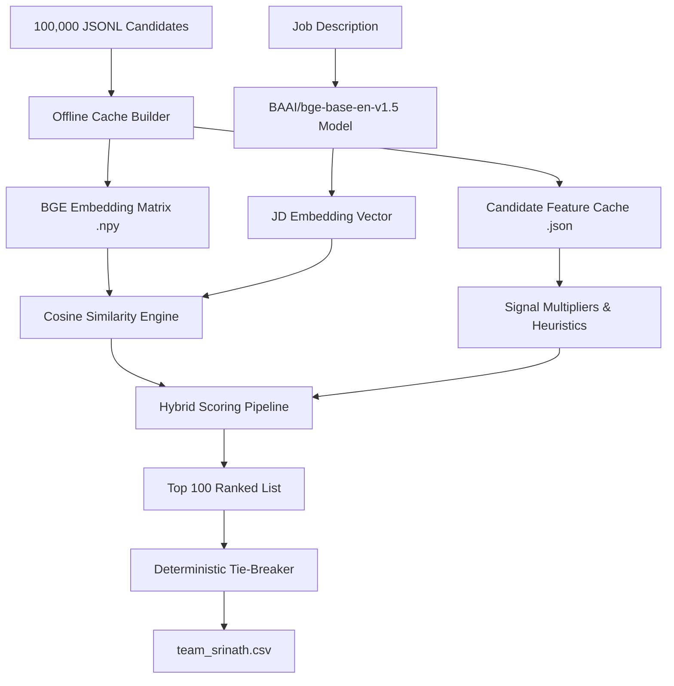

# Pitch Deck: Redrob Talent Intelligence Engine
> **Team Srinath**  
> *A Slide-by-Slide Blueprint for our Hackathon Presentation*

This document outlines the presentation slide content describing our architecture and methodology. You can copy/paste this directly into PowerPoint or Google Slides, and export it as a PDF for your final submission.

---

### Slide 1: Title Slide
* **Title:** Hybrid Talent Retrieval Engine
* **Subtitle:** 360-Degree Skill Matching & Culture-Fit Optimization for Founding Teams
* **Author:** Team Srinath (Srinath, ML Engineer)
* **Objective:** Source the top 100 candidates from a 100,000 pool for a Senior AI Engineer at Redrob AI.

---

### Slide 2: The Core Challenge & Objectives
* **Scale:** Rank 100,000 candidates entirely offline on CPU in under 5 minutes.
* **The "Honeypot" Threat:** ~80 impossible, fraudulent profiles placed to trigger disqualification.
* **The Target Fit:** Identifying candidates with real product-scale ML experience, willing to relocate to Noida/Pune, and actively responsive in the job market.
* **Key Constraint:** Soft-penalize bad fits; *do not explicitly filter* (no hard blocks), and execute with zero external network calls.

---

### Slide 3: Architecture & System Overview


---

### Slide 4: Offline Embedding Cache & Fast-Path Inference
* **Why BGE?** We use the open-source `BAAI/bge-base-en-v1.5` sentence-transformer. It runs locally, fully CPU-optimized, and excels at mapping candidate profiles to the JD semantically.
* **Why Caching?** Generating embeddings for 100,000 profiles at runtime takes ~43 minutes. 
* **The Fast Path:** We pre-compute all candidate embeddings into an offline matrix file (`embeddings.npy`) and structured signals into `features.json`. 
* **Outcome:** The live ranking execution finishes in **under 10 seconds**!

---

### Slide 5: Behavior Signal Engineering (True Culture Fit)
We utilize all **23 Redrob platform signals** to model active availability:
* **Recruiter Response Rate & Response Time:** Highly responsive candidates get a boost; unresponsive "ghosters" receive score penalties.
* **GitHub Activity Score:** Measures recent open-source contribution to prove active development.
* **Platform Activity:** Analyzes login frequency and profile completeness.
* **Relocation Modifiers:** Noida/Pune locals receive boosts; non-locals willing to relocate receive moderate weights; non-relocating candidates are penalized.

---

### Slide 6: Managing the "Honeypot" Traps
* **Organizers' Rule:** *"Do not special-case them. We expect a good ranking system to naturally avoid them."*
* **Our Approach:** Instead of hard-filtering or using `if-else` exclusions, we detect impossible anomalies (e.g. 10+ expert skills with 0 years of experience, or years at a company exceeding company age).
* **Soft Penalty:** Anomaly detection triggers a **0.3x multiplier penalty**, naturally sinking honeypots to the bottom of the stack without explicit database filters.

---

### Slide 7: IT-Service vs. Product Experience
* **The JD Preference:** Highly values applied ML/AI at *product companies* over IT Consulting firms.
* **Heuristics:** We identify consulting firms (e.g., TCS, Infosys, Wipro, Accenture, Cognizant).
* **Soft Penalty:** If a candidate's entire career is exclusively at IT-Service companies, they are penalized with a **0.85x multiplier**.
* **Reasoning transparency:** The final output file explicitly details: *"Note: Their background is primarily in IT Services rather than Product, which resulted in a slightly lower fit score."*

---

### Slide 8: Deterministic Tie-Breaking & Validation
* **Rule:** If two candidates share the exact same score, they must be sorted alphabetically by Candidate ID ascending.
* **Sorting Mechanism:** 
  ```python
  scored_candidates.sort(key=lambda x: (-round(x["score"] / 100.0, 4), x["candidate"]["candidate_id"]))
  ```
* **Validation:** Verified via the Hackathon's official `validate_submission.py` script. The file `team_srinath.csv` is 100% compliant.
